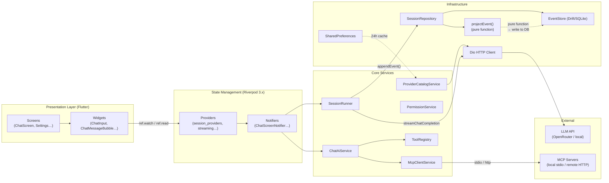
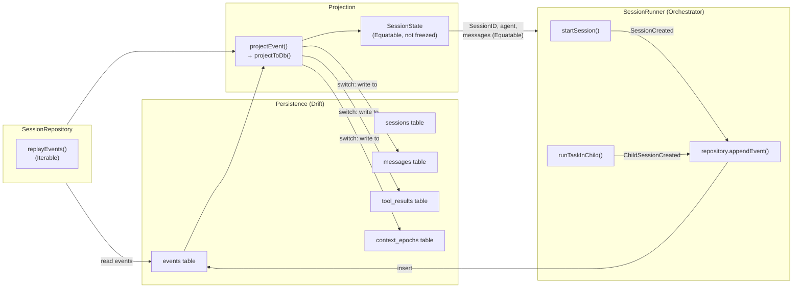
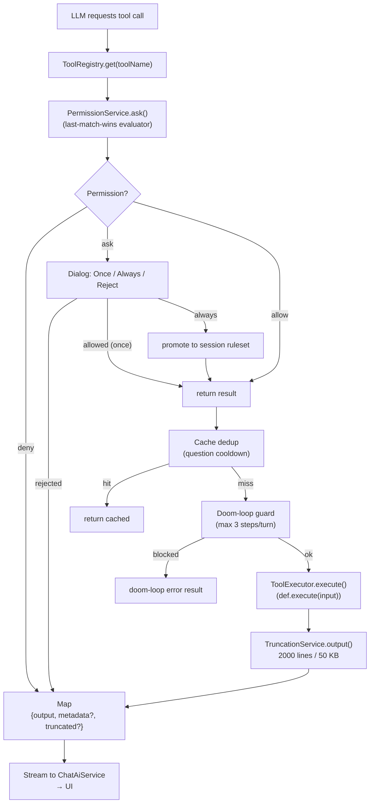
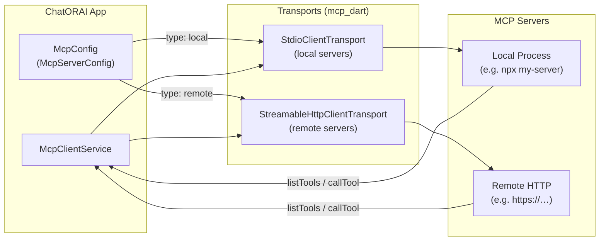
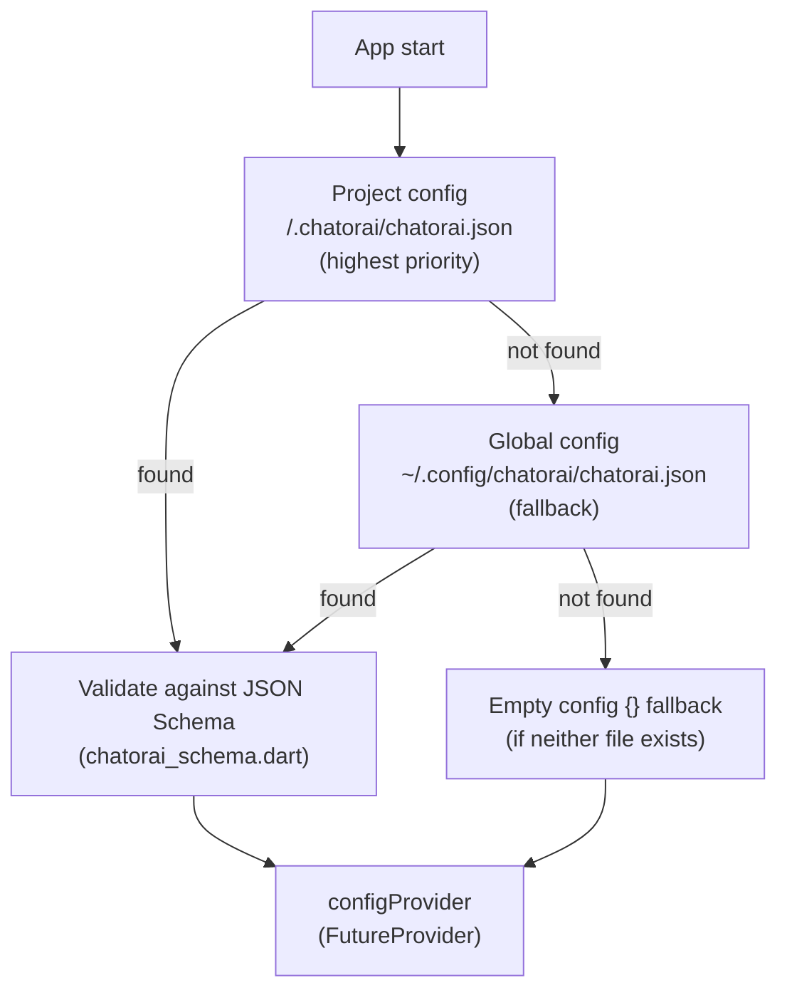

# Architecture Overview Diagrams

**Last updated:** 2026-07-07

This file contains high-level mermaid diagrams for data flow, session pipeline,
tool execution, MCP topology, and config resolution.  Each diagram is
self-contained and cross-referenced to the relevant `.md` file.
---
## High-Level Data Flow

---
## Session Event Pipeline

---
## Tool Execution Lifecycle

---
## MCP Connection Architecture

---
## Config Resolution Chain

**Note:** First-found-wins — no CLI/env overrides, no merging of multiple configs.
---
## Reference

| Diagram | Described in | Source files |
|---------|-------------|--------------|
| High-Level Data Flow | `ARCHITECTURE.md` | `main.dart`, `lib/features/`, `lib/core/` |
| Session Event Pipeline | `docs/API.md` → SessionRunner | `lib/core/session/session_runner.dart`, `event_store.dart`, `projector.dart` |
| Tool Execution Lifecycle | `docs/API.md` → Tools | `lib/core/tools/tool_registry.dart`, `tool_execution.dart` |
| MCP Connection Architecture | `docs/API.md` → McpClientService | `lib/core/mcp/mcp_client_service.dart` |
| Config Resolution Chain | `docs/configuration.md` | `lib/core/config/config_loader.dart`, `docs/xdg-paths.md` |
