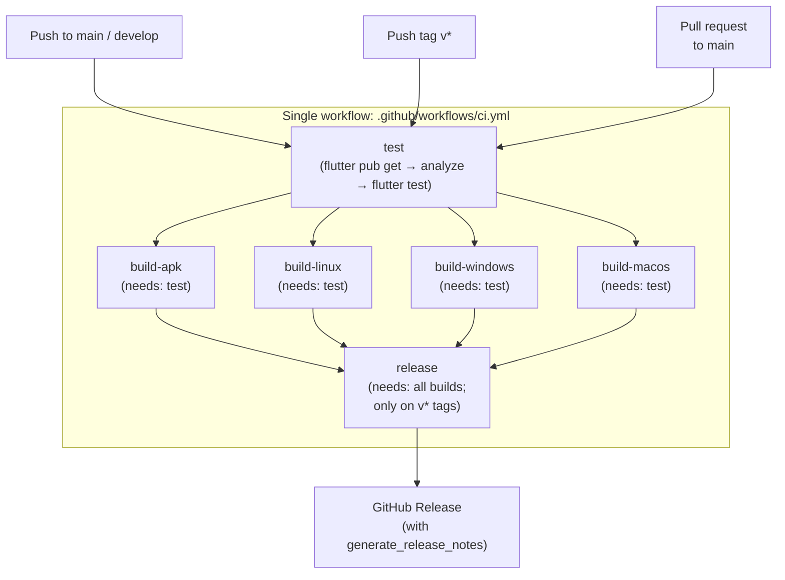
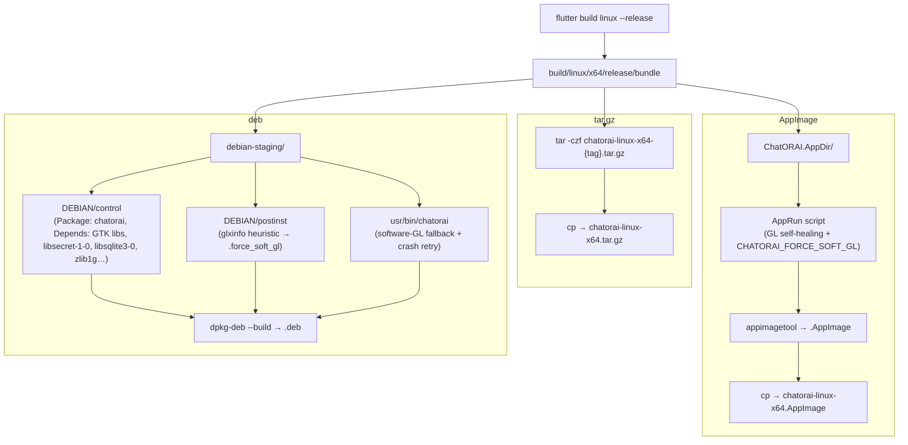
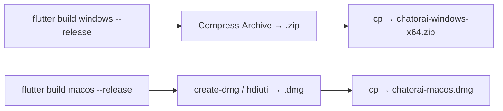
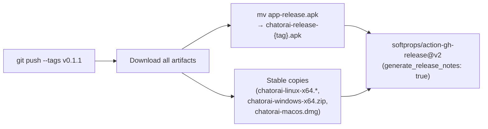

# CI / Release Pipeline Diagrams

**Last updated:** 2026-07-08

This file documents the single GitHub Actions workflow, build matrix, and
GitHub Release publication flow used for every tagged version of ChatORAI.
---
## Workflow Topology

**Note:** `release.yml` was deleted. All jobs live in `.github/workflows/ci.yml`.
Cross-workflow `needs:` is not supported by GitHub Actions, so release stays in
the same file.
---
## Linux Artifact Packaging

**Install paths (all Linux formats consistent):**
- tarball / AppImage: `/usr/local/lib/chatorai` + `/usr/local/bin/chatorai`
- deb: `/usr/local/lib/chatorai` + `/usr/bin/chatorai`

No stale `/usr/lib/chatorai` paths remain.
---
## Windows / macOS Artifacts

---
## Release Publication

**First git tag:** `v0.1.0`  
**Current version:** `0.1.1`