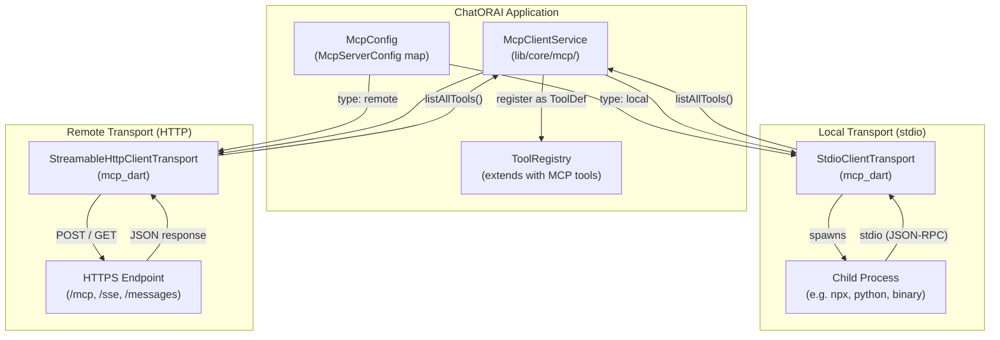
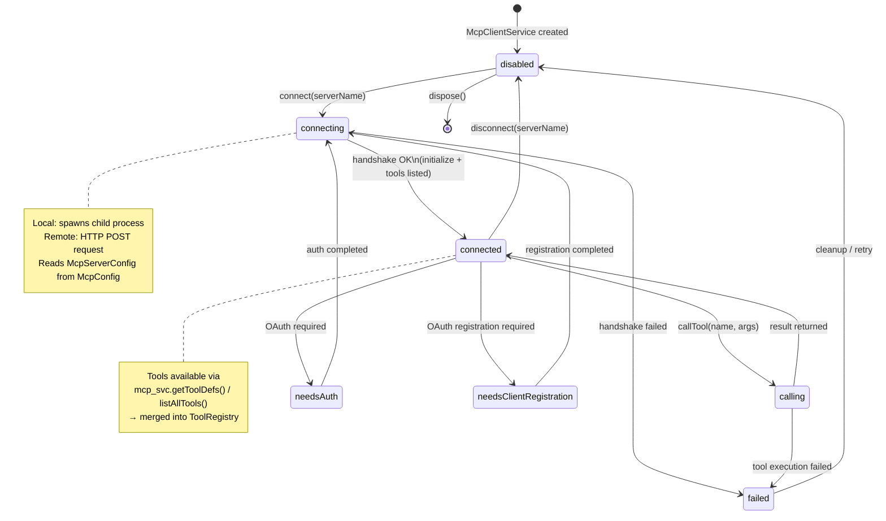
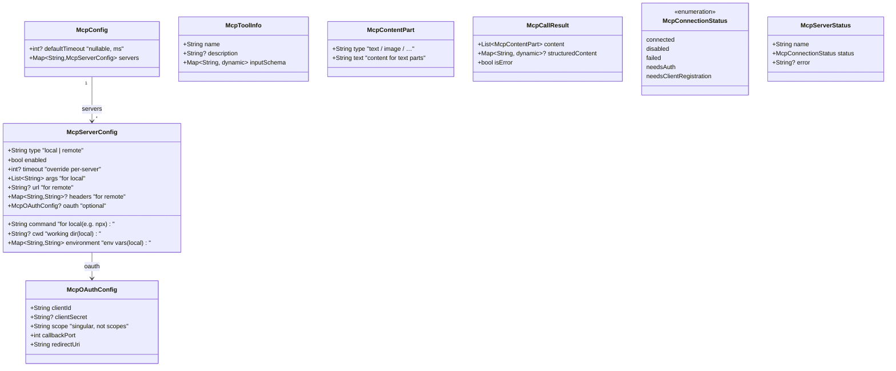

# MCP Integration Diagrams

**Last updated:** 2026-07-07

This file documents the Model Context Protocol (MCP) client architecture: transport
selection, connection lifecycle, and tool proxying.  MCP extends ChatORAI's tool
system with external capabilities from local processes or remote servers.
---
## Transport Topology

---
## MCP Connection Lifecycle

---
## MCP Config Model

---
## Reference

| Diagram | Source |
|---------|--------|
| Transport Topology | `lib/core/mcp/mcp_client_service.dart` |
| Connection Lifecycle | `lib/core/mcp/mcp_client_service.dart` (`connect`, `disconnect`) |
| Config Models | `lib/core/mcp/mcp_config.dart` |
| Types | `lib/core/mcp/mcp_types.dart` |
| JSON config | `docs/configuration.md` → `mcp` section |
