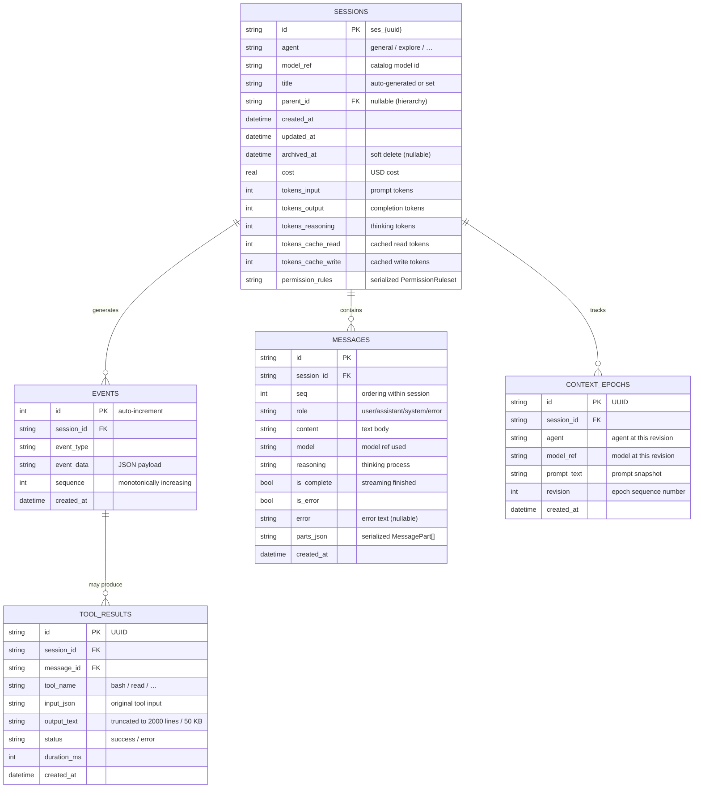
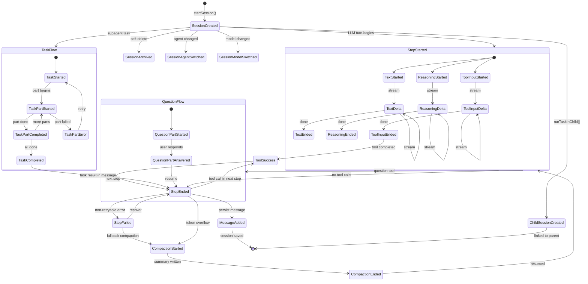
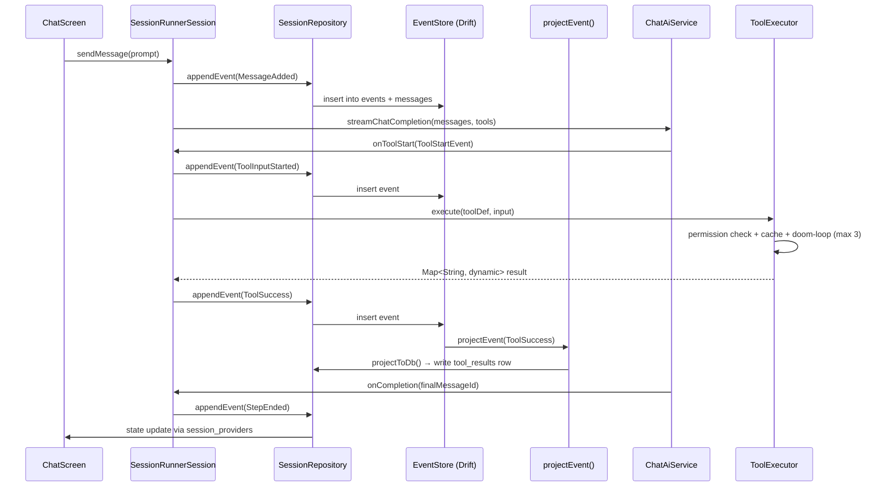

# Session Core Diagrams

**Last updated:** 2026-07-07

This file documents the event-sourced session subsystem: Drift database schema
(ER diagram) and the `SessionEvent` state machine.
---
## Drift Database ER Diagram

---
## SessionEvent State Machine

---
## Event Sequence: Tool Call Turn (Typical)

---
## Reference

| Diagram | Source |
|---------|--------|
| ER Schema | `lib/core/session/database.dart` (Drift tables, schema.dart columns) |
| Event State Machine | `lib/core/session/events.dart` (sealed `SessionEvent`) |
| Sequence | `lib/core/session/session_runner.dart` (`SessionRunnerSession.appendEvent`) |
