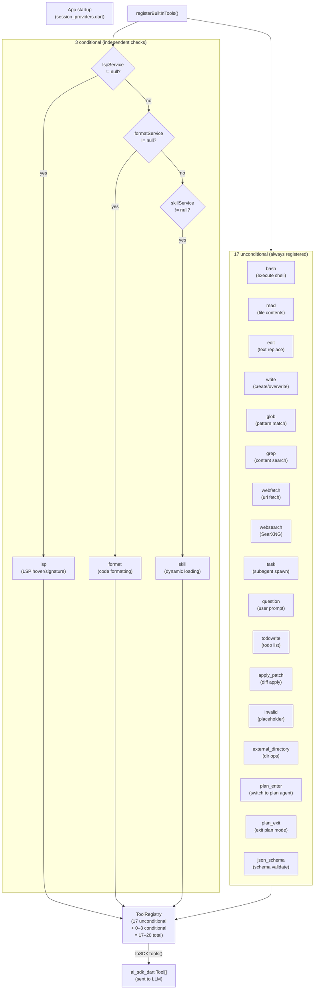
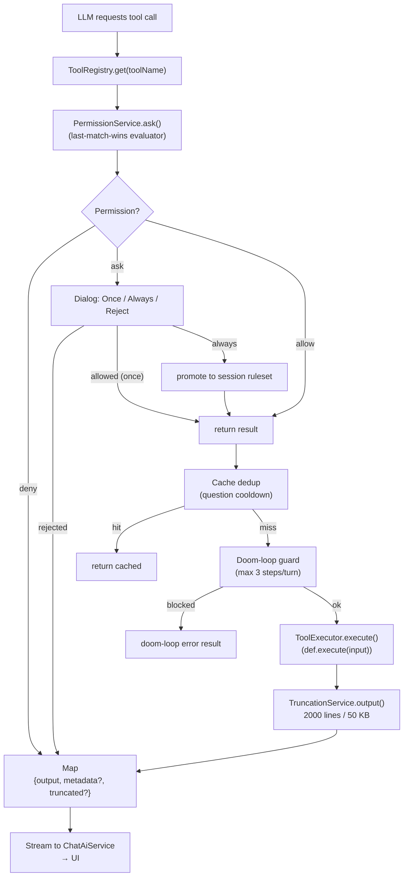
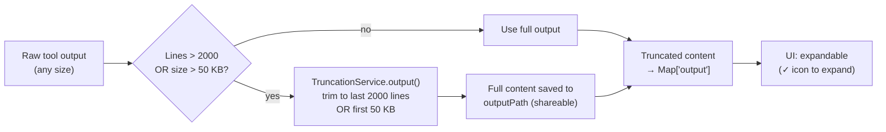

# Tool System Diagrams

**Last updated:** 2026-07-08

This file documents the tool registry, conditional registration, and execution
lifecycle.  See also `docs/API.md` → Tools for the full input-schema table.
---
## Tool Registry: Conditional Registration

**Registration source:** `lib/core/tools/built_in/built_in_tools.dart`
**Conversion:** `ToolRegistry.toSDKTools()` → `ai_sdk_dart` `Tool` objects

**Note:** All three conditional checks are independent `if` statements — `lsp`,
`format`, and `skill` can all be registered simultaneously if all services are
provided.  `skill` is NOT unconditional; it is only registered when
`skillService != null`.
---
## Tool Execution Request Flow

---
## Tool Output Truncation

---
## Reference

| Diagram | Source |
|---------|--------|
| Conditional Registration | `lib/core/tools/built_in/built_in_tools.dart` |
| Execution Request Flow | `lib/core/tools/tool_execution.dart` |
| Truncation Service | `lib/core/tools/truncation_service.dart` |
| Permission Pipeline | `lib/core/permission/evaluator.dart`, `ruleset.dart` |
| Tool Definitions | `lib/core/tools/built_in/*.dart` (one file per tool) |
